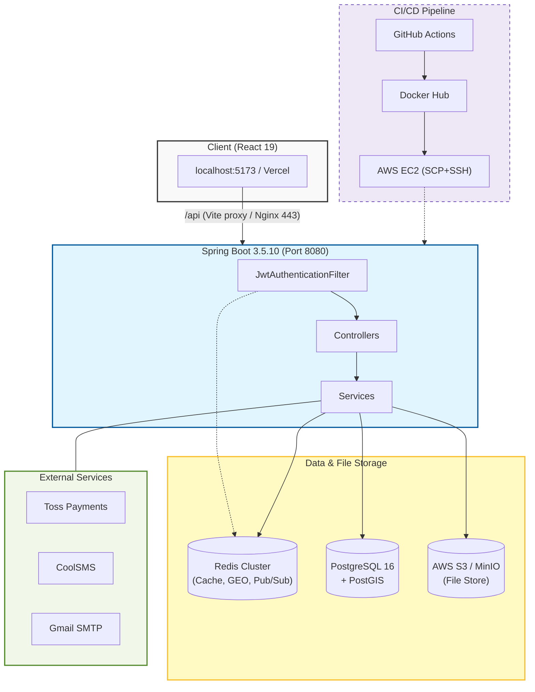

<div align="center">


<p align="center">
  
</p>


</div>

---

## 목차

- [목차](#목차)
- [🏘 프로젝트 소개](#-프로젝트-소개)
- [🛠 기술 스택](#-기술-스택)
- [🏗 시스템 아키텍처](#-시스템-아키텍처)
  - [Spring 프로파일](#spring-프로파일)
- [⚙ 핵심 기술 구현](#-핵심-기술-구현)
  - [1. Redis 분산 락 + GEO 기반 실시간 배차 시스템](#1-redis-분산-락--geo-기반-실시간-배차-시스템)
  - [2. 이벤트 기반 실시간 알림 아키텍처 (SSE + Spring Events + Redis Pub/Sub)](#2-이벤트-기반-실시간-알림-아키텍처-sse--spring-events--redis-pubsub)
  - [3. Spring Batch 5 기반 주간 정산 파이프라인](#3-spring-batch-5-기반-주간-정산-파이프라인)
- [🚀 CI/CD 파이프라인](#-cicd-파이프라인)
- [⚡ 빠른 시작](#-빠른-시작)
  - [사전 준비 (로컬)](#사전-준비-로컬)
  - [빌드 및 실행](#빌드-및-실행)
  - [프로덕션 Docker 실행](#프로덕션-docker-실행)
- [📡 API 응답 형식](#-api-응답-형식)
- [📦 도메인 구조](#-도메인-구조)
- [🏗 인프라 환경](#-인프라-환경)
- [🔐 환경 변수](#-환경-변수)
- [📁 주요 파일 위치](#-주요-파일-위치)

---

## 🏘 프로젝트 소개

**동네마켓**은 고객, 동네  마트, 배달 라이더, 플랫폼 관리자 **4개 역할**이 유기적으로 연결되는 동네 배달 플랫폼입니다.

기존 대형 배달 플랫폼이 해결하지 못한 **동네 밀착형 유통 문제**에 집중합니다.

| 역할 | 핵심 기능 |
|------|----------|
| **고객 (CUSTOMER)** | 장바구니·주문·결제·정기구독·리뷰·배달 추적 |
| **마트 (STORE)** | 상품 관리·주문 접수·정산 내역·1:1 문의 응답 |
| **라이더 (RIDER)** | 실시간 배달 요청 수신·위치 공유·주간 정산 |
| **관리자 (ADMIN)** | 회원·마트·라이더 승인, 재무 통계, 공지·배너 관리 |

> 단순 CRUD를 넘어, **분산 락 기반 동시성 제어**, **이벤트 기반 실시간 알림**, **배치 정산 처리** 등 실제 서비스 운영 수준의 기술 과제를 다룹니다.

---

## 🛠 기술 스택

<details>
<summary><b>Backend Core</b></summary>


</details>

<details>
<summary><b>Database & Cache</b></summary>


</details>

<details>
<summary><b>Authentication & External API</b></summary>

-000000?style=flat-square&logo=jsonwebtokens&logoColor=white)
-FFCD00?style=flat-square&logo=kakao&logoColor=black)


</details>

<details>
<summary><b>DevOps & Infrastructure</b></summary>


-FF9900?style=flat-square&logo=amazonaws&logoColor=white)


-C72E49?style=flat-square&logo=minio&logoColor=white)


</details>

---

## 🏗 시스템 아키텍처



### Spring 프로파일

| 프로파일 | 활성화 | 특징 |
|----------|--------|------|
| `prod` | 기본값 | AWS RDS, Redis Cluster SSL, 엄격한 CORS |
| `local` | `--spring.profiles.active=local` | 완화된 CORS, `LocalDataInitializer` 테스트 데이터 자동 주입 |

---

## ⚙ 핵심 기술 구현

### 1. Redis 분산 락 + GEO 기반 실시간 배차 시스템

> **문제 상황**: 동일 배달 요청에 복수의 라이더가 동시에 수락을 시도하면 중복 배정이 발생합니다. 기존 DB 트랜잭션 락만으로는 다중 인스턴스 환경에서 안전을 보장할 수 없습니다.

**해결 전략** — `DeliveryMatchComponent.java`

```
배달 요청 발생
  │
  ▼
① Redis GEO (RIDER_LOC_KEY)
   └─ 마트 좌표 반경 10km 내 ONLINE/DELIVERING 라이더 탐색
  │
  ▼
② SSE → 주변 라이더 전체에게 NEW_DELIVERY 이벤트 브로드캐스트

라이더 A, B가 동시에 수락 시도
  │
  ▼
③ Redis SETNX (DELIVERY_LOCK_PREFIX + deliveryId)
   ├── 성공 (A): 배정 로직 진행 → 완료 후 afterCompletion()에서 락 해제
   └── 실패 (B): DELIVERY_ALREADY_LOCKED 예외 즉시 반환

④ 배정 성공 시
   ├── Redis GEO에서 해당 배달 제거
   ├── Redis SET (RIDER_DISPATCH_PREFIX)로 라이더 동시 배달 수 관리 (최대 3건)
   └── 주변 라이더 + 마트 사장님에게 DELIVERY_MATCHED SSE 전송
```

**핵심 포인트**:
- `redisTemplate.opsForValue().setIfAbsent(lockKey, username, Duration.ofSeconds(5))` — 5초 TTL의 원자적 락
- `TransactionSynchronizationManager.registerSynchronization()` — DB 트랜잭션 커밋/롤백 완료 후 락 해제 보장
- `redisTemplate.opsForGeo().search()` — Redis GEO SEARCH 명령으로 반경 내 라이더 조회 (PostGIS 쿼리 부하 최소화)

---

### 2. 이벤트 기반 실시간 알림 아키텍처 (SSE + Spring Events + Redis Pub/Sub)

> **문제 상황**: 주문 접수, 배달 배정, 알림 저장 등의 부수 작업이 핵심 비즈니스 로직과 강하게 결합되면, 단일 책임 원칙을 위반하고 테스트 가능성이 떨어집니다.

**해결 전략** — 도메인 이벤트 → 비동기 리스너 분리

```
[Order 서비스] 주문 생성 완료
  │
  └─► applicationEventPublisher.publishEvent(new StoreOrderCreatedEvent(...))
          │
          ├─► StoreOrderSseListener      → SseService.send(storeOwnerId, "store-order-created", payload)
          ├─► StoreOrderRedisTtlListener → Redis TTL 설정 (자동 접수 거절 타이머)
          └─► StoreOrderNotificationListener → Notification DB 저장

[Frontend] GET /api/notifications/subscribe
  └─► SseEmitter 생성 & SseService에 등록
        │ (Multi-instance)
        └─► Redis Pub/Sub 채널 구독 → 타 인스턴스에서 발행한 이벤트도 수신

SSE 이벤트 타입 목록:
  NEW_DELIVERY      → 라이더: 주변 신규 배달 요청
  NEARBY_DELIVERIES → 라이더: 현재 위치 기준 배달 목록 갱신
  DELIVERY_MATCHED  → 고객/마트: 라이더 배정 완료
  store-order-created → 마트: 새 주문 알림
```

**Nginx SSE 설정** (`nginx/default.conf`):
```nginx
proxy_buffering         off;
proxy_cache             off;
proxy_read_timeout      86400s;  # 24시간 연결 유지
```

---

### 3. Spring Batch 5 기반 주간 정산 파이프라인

> **문제 상황**: 매주 수백~수천 건의 배달 완료 내역을 집계하여 라이더별·마트별 정산 금액을 계산해야 합니다. 단순 배치 스크립트는 장애 복구, 재실행, 진행 추적이 어렵습니다.

**해결 전략** — Spring Batch 5 Chunk-oriented Processing

```
RiderSettlementScheduler (매주 Cron)
  │
  └─► JobLauncher.run(riderWeeklySettlementJob, jobParameters)
          │
          ├── JobParameter: targetWeekStart=2026-02-16 (직전 주 월요일)
          │
          └── Step: riderWeeklySettlementStep (chunk-size=100)
                  │
                  ├── Reader  (RiderSettlementItemReader)
                  │     └─ @StepScope + @Value("#{jobParameters['targetWeekStart']}")
                  │         QueryDSL로 해당 주간 완료 배달 라이더 목록 페이징 읽기
                  │
                  ├── Processor (RiderSettlementItemProcessor)
                  │     └─ 중복 정산 방지: 기간별 Settlement 존재 여부 확인
                  │
                  └── Writer (RiderSettlementItemWriter)
                        └─ Settlement + RiderSettlementDetail 일괄 저장
                            JdbcTemplate bulk insert로 성능 최적화
```

**핵심 포인트**:
- `spring.batch.job.enabled: false` — 스케줄러가 명시적으로 `JobLauncher`를 호출해 자동 실행 방지
- `@StepScope` — Job Parameter가 Step 실행 시점에 바인딩되어 재실행 안전성 보장
- `SettlementWeekUtil.prevWeekStartDate()` — 파라미터 없을 시 현재 시점 기준 직전 월요일로 fallback

---

## 🚀 CI/CD 파이프라인

```
[main 브랜치 push / PR]
        │
        ▼
  ┌─────────────────────────────┐
  │    build-and-push (CI)      │
  │                             │
  │  1. JDK 21 (Corretto) 셋업  │
  │  2. ./gradlew clean build   │
  │     -x test                 │
  │  3. Docker 이미지 빌드       │
  │  4. Docker Hub push         │
  │     ($USER/final-back:latest)│
  └──────────────┬──────────────┘
                 │ (main push only)
                 ▼
  ┌─────────────────────────────┐
  │      deploy (CD)            │
  │                             │
  │  1. SCP: docker-compose.yaml│
  │     + nginx/ → EC2          │
  │  2. SSH:                    │
  │     docker pull :latest     │
  │     docker-compose down     │
  │     docker-compose up -d    │
  │     docker image prune -f   │
  └─────────────────────────────┘
```

**필요한 GitHub Secrets**: `DOCKER_USERNAME` `DOCKER_PASSWORD` `EC2_HOST` `EC2_USER` `EC2_SSH_KEY`

> `docker-compose.yaml`의 메모리 제한(`700M`)은 t3.micro(1GiB RAM) 환경에서 OOM을 방지합니다.

---

## ⚡ 빠른 시작

### 사전 준비 (로컬)

```bash
# PostgreSQL + PostGIS
docker run -d --name pg \
  -e POSTGRES_DB=neighborhood_market \
  -e POSTGRES_USER=user -e POSTGRES_PASSWORD=pass \
  -p 5432:5432 postgis/postgis:16-3.4

# Redis
docker run -d --name redis -p 6379:6379 redis:7-alpine

# MinIO (S3 호환)
docker run -d --name minio \
  -e MINIO_ROOT_USER=minioadmin -e MINIO_ROOT_PASSWORD=minioadmin \
  -p 9000:9000 -p 9001:9001 minio/minio server /data --console-address ":9001"
```

### 빌드 및 실행

```bash
cp .env.template .env          # 환경 변수 설정

# 빌드 (QueryDSL Q클래스 생성 포함, 테스트 스킵)
./gradlew clean build -x test

# 로컬 프로파일 실행 (완화된 CORS + LocalDataInitializer 테스트 데이터)
./gradlew bootRun --args='--spring.profiles.active=local'

# 통합 테스트 (Docker 필요 — Testcontainers)
./gradlew test
```

> **QueryDSL**: JPA 엔티티 추가·수정 후 반드시 `./gradlew clean build -x test`로 Q클래스를 재생성하세요. 생성 위치: `build/generated/querydsl/`

### 프로덕션 Docker 실행

```bash
# final-back/ 디렉토리에서
docker-compose up -d             # 백엔드 + Nginx 시작
docker-compose down              # 중지
docker-compose logs -f backend   # 로그 스트리밍
```

---

## 📡 API 응답 형식

모든 컨트롤러는 `ApiResponse<T>` 래퍼를 반환합니다 (`global/response/ApiResponse.java`).

<details>
<summary><b>성공 응답 예시</b></summary>

```json
{
  "success": true,
  "code": "SUCCESS",
  "message": "요청이 성공했습니다.",
  "data": { "orderId": 42, "status": "PAID" },
  "timestamp": "2026-02-25T10:00:00+09:00"
}
```

</details>

<details>
<summary><b>오류 응답 예시</b></summary>

```json
{
  "success": false,
  "error": {
    "code": "ORDER-001",
    "message": "주문을 찾을 수 없습니다.",
    "details": []
  },
  "timestamp": "2026-02-25T10:00:00+09:00"
}
```

에러 코드는 도메인 접두사(`ORDER-NNN`, `AUTH-NNN`, `DELIVERY-NNN`, `PAYMENT-NNN` 등)로 구성됩니다. 전체 목록: `global/exception/custom/ErrorCode.java`

</details>

---

## 📦 도메인 구조

`com.example.finalproject` 하위 **18개 패키지**, 각 패키지는 `controller → service → repository → entity` 레이어를 따릅니다.

<details>
<summary><b>도메인 패키지 전체 목록</b></summary>

| 패키지 | 역할 |
|--------|------|
| `auth` | JWT 발급/검증, OAuth2 (카카오/네이버), SMS 인증, 비밀번호 재설정 |
| `user` | 회원 관리, 소셜 로그인 연동, 탈퇴 |
| `store` | 마트 등록/검색, 영업시간, 정산 계좌 |
| `product` | 상품 관리, 재고 이력 |
| `order` | 주문 생성/조회, 마트별 주문, Redis TTL 장바구니 |
| `checkout` | 가격 계산 (Strategy 패턴: `PriceCalculator`) |
| `delivery` | 배달 배정, 라이더 프로필, Redis GEO 위치 추적 |
| `payment` | 토스페이먼츠 연동, Billing Key AES 암호화, 환불 처리 |
| `subscription` | 정기 구독 주문 (요일 스케줄링, 자동 결제) |
| `settlement` | 마트/라이더 정산 (Spring Batch 5) |
| `communication` | 1:1 문의, SSE 알림, 관리자 공지 브로드캐스트 |
| `moderation` | 마트/라이더 승인, 신고 처리 |
| `content` | FAQ, 공지사항, 배너, 프로모션 |
| `review` | 상품 리뷰 + 사장님 답글 |
| `coupon` | 쿠폰 관리 |
| `admin` | 회원/재무 통계, 승인 관리 |
| `global` | 공통 인프라 (JWT, Security, SSE, S3, 예외처리) |

</details>

<details>
<summary><b>주요 크로스 도메인 이벤트 흐름</b></summary>

```
주문 결제 완료
  └─► StoreOrderCreatedEvent 발행
        ├── StoreOrderSseListener       → 마트 SSE 알림
        ├── StoreOrderRedisTtlListener  → Redis TTL (자동 접수 거절 타이머)
        └── StoreOrderNotificationListener → DB 알림 저장

구독 정기 결제
  └─► SubscriptionBillingScheduler (Cron)
        └─► BillingController → 토스페이먼츠 자동 청구 (AES 복호화된 Billing Key 사용)

정산 배치
  └─► StoreSettlementScheduler / RiderSettlementScheduler (Cron)
        └─► Spring Batch Job (Reader → Processor → Writer)
```

</details>

---

## 🏗 인프라 환경

| 서비스 | 로컬 개발 | 프로덕션 |
|--------|-----------|---------|
| **Database** | PostgreSQL + PostGIS (Docker) | AWS RDS |
| **Cache** | Redis single (Docker) | AWS ElastiCache (Cluster SSL) |
| **File Store** | MinIO (port 9000) | AWS S3 |
| **Reverse Proxy** | — | Nginx on EC2 (Let's Encrypt SSL) |
| **App Server** | `./gradlew bootRun` | Docker Container on EC2 (mem: 700M) |

---

## 🔐 환경 변수

<details>
<summary><b>전체 환경 변수 목록 (.env.template 기준)</b></summary>

| 카테고리 | 변수 |
|----------|------|
| **DB** | `DB_HOST` `DB_PORT` `DB_NAME` `DB_USERNAME` `DB_PASSWORD` `JPA_DDL_AUTO` |
| **Redis** | `REDIS_HOST` `REDIS_PORT` |
| **AWS S3** | `AWS_ACCESS_KEY_ID` `AWS_SECRET_ACCESS_KEY` `AWS_REGION` `S3_BUCKET_NAME` |
| **JWT** | `JWT_SECRET` `JWT_ACCESS_TOKEN_VALIDITY_SECONDS` `JWT_REFRESH_TOKEN_VALIDITY_SECONDS` |
| **암호화** | `CRYPTO_AES_KEY` (32바이트 — 구독 Billing Key AES 암호화) |
| **OAuth2** | `KAKAO_CLIENT_ID/SECRET/REDIRECT_URI` `NAVER_CLIENT_ID/SECRET/REDIRECT_URI` |
| **SMS** | `COOLSMS_API_KEY` `COOLSMS_API_SECRET` `COOLSMS_SENDER` |
| **이메일** | `MAIL_USERNAME` `MAIL_PASSWORD` |
| **결제** | `TOSS_SECRET_KEY` |
| **URL** | `FRONTEND_URL` `CORS_ALLOWED_ORIGINS` `RESET_PASSWORD_URL` |
| **배포** | `DOCKER_USERNAME` `SERVER_NAME` `BACKEND_HOST` |

</details>

---

## 📁 주요 파일 위치

| 목적 | 경로 |
|------|------|
| 에러 코드 전체 목록 | `global/exception/custom/ErrorCode.java` |
| API 응답 래퍼 | `global/response/ApiResponse.java` |
| JWT 토큰 처리 | `global/jwt/JwtTokenProvider.java` |
| PostGIS 거리 계산 | `global/util/GeometryUtil.java` |
| SSE 서비스 | `global/sse/Service/SseService.java` |
| 분산 락 + GEO 배차 | `delivery/component/DeliveryMatchComponent.java` |
| 가격 계산 전략 인터페이스 | `checkout/service/PriceCalculator.java` |
| 소셜 로그인 전략 | `auth/social/SocialLoginStrategy*.java` |
| 마트 정산 배치 | `settlement/store/batch/StoreSettlementBatchConfig.java` |
| 라이더 정산 배치 | `settlement/rider/batch/RiderSettlementBatchConfig.java` |
| 프로덕션 설정 | `src/main/resources/application-prod.yml` |
| Nginx 설정 | `nginx/default.conf` |
| 환경변수 템플릿 | `.env.template` |

---

<div align="center">


</div>
